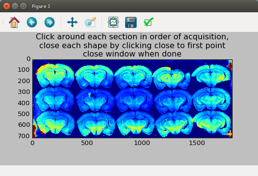
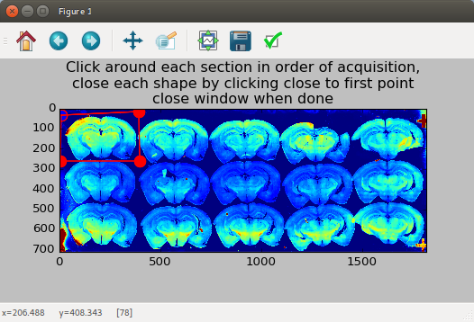
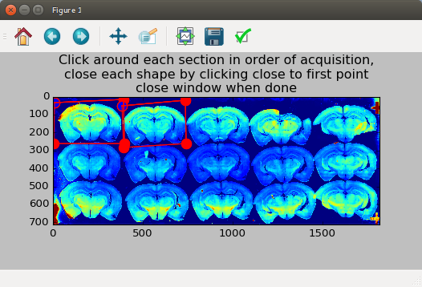

### Script by tpisano@princeton.edu for alignment of *Nanozoomer* tissue sections.

## Installation Instructions:
  * Requirements:
    * Python (2.7, not 3+).
	* *openslide-tools* package - see below for linux installation
	* This package was made for linux/osx, and has not been tested on windows. If running windows I would suggest using a virtual machine.
		1. [Download Virtual Box](https://www.virtualbox.org/wiki/Downloads)
		2. [Download Linux Ubuntu](https://www.ubuntu.com/download)
		3. [Install the VM machine](http://www.instructables.com/id/How-to-install-Linux-on-your-Windows/)

## Install necessary dependencies using anaconda (Install [anaconda](https://www.anaconda.com/download/) if not already):
  * conda install numpy pandas skimage shutil
  * conda install -c menpo opencv (requires opencv 3+; if this fails then try: conda install -c conda-forge opencv)
  * sudo apt-get install openslide-tools
  * pip install [openslide-python](https://openslide.org/api/python/)

## To use:
  1. Open the *serial_section_processing.py*
  2. Go to the bottom of the file where it says *"Modify below"*
  3. Adjust the following inputs:
        * **src**: list of main .npdi files in the correct order (note accompanying .ndpi files must be in same folder)
        * **dst**: output location of this script
        * **parameters**: list of elastix parameter .txt files to use. The *align_slices_elastix_parameters.txt* in this package typically works well.
        * **section_depth**: spacing between slides
        * **level**: integer value representing resolution to use. 1 is full resolution, usually 7 is fairly small. This will depend on acquisition parameters. Sometimes full resolution has too many pixels for most programs like *openslide-python* and *ImageJ/Fiji*
        * **channel** to use for alignment e.g. 'Trtc', 'Brighfield'
  4. Save and close this script.
  5. Open up a terminal window (linux: "CTL + ALT + T")
  6. Change directories into local folder containing this repository
  7. *python serial_section_processing.py*:
        	
		a) After preprocessing steps, a window will appear with your sections, I suggest expanding the window size 
                

		b) Click around those sections in order of plating
		

		c) Close the shape by clicking close to the starting point, which will turn blue
		

		d) Repeat for all sections in the * **order of plating** *.
		
        * Ideally there should be a consistent border around each section and the section should be in the middle of box.
        * Repeat for each section and close the window.
        * The next window will open, and rinse and repeat for all sections.
  8. :coffee:+ :pray:

:v:
